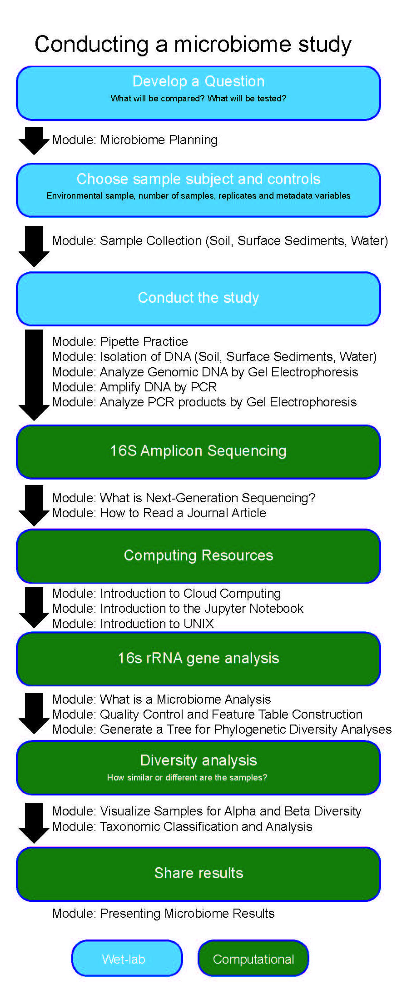

#### <u>Microbiome [16S rRNA] Course-based Research Experience (CRE)</u>
*Currently developing a laboratory course (12-14 week) collecting environmental samples, extracting DNA, sequencing V4 region of 16S rRNA gene and performing data analysis with QIIME2.*

<h4>contact</h4>

Joslynn Lee, Ph.D. 
Email: leej2@hhmi.org 

#### <u>Science Education Alliance - Phage Hunters Advancing Genomics and Evolutionary Sciences (SEA-PHAGES)</u>
* [Science Education Alliance (SEA)](https://www.hhmi.org/developing-scientists/science-education-alliance) works with faculty members from more than 100 colleges and universities around the country to engage thousands of undergraduate students each year in authentic scientific discovery early in their academic careers.

Teaching assistant for the phage discovery workshop to familiarize new faculty with the concepts and associated techniques of bacteriophage isolation and characterization. Teaching assistant for the bioinformatics workshop to familarize new faculty with the concepts of genome annotation and comparative genomics using the tools DNA Master and Phamerator.*

[June 2018 	Phage Discovery Workshop, Teaching Assistant, Baltimore, MD](https://seaphages.org/meetings/38/)

[July 2018	Phage Discovery Workshop, Teaching Assistant, Baltimore, MD](https://seaphages.org/meetings/37/)

[Dec 2017	Bioinformatics Workshop, Teaching Assistant, Chevy Chase, MD](https://seaphages.org/meetings/30/)

[July 2017	Phage Discovery Workshop, Teaching Assistant, Baltimore, MD](https://seaphages.org/meetings/27/)

[June 2017	Phage Discovery Workshop, Teaching Assistant, Baltimore, MD](https://seaphages.org/meetings/26/)

#### <u>The Carpentries (Software and Data Carpentry)</u>
*Attended Carpentry training at University of Florida Gainsville in January 2017. Teaching UNIX shell and R lessons.*

Software and Data Carpentry, one-day basic lab skills for research computing lessons
[Oct 2018	Lesson: The UNIX Shell, SACNAS National Conference, San Antonio, TX](https://galaxyproject.org/events/2018-sacnas/)

[Oct 2017	Lesson: The UNIX Shell, SACNAS National Conference, Salt Lake City, UT](https://galaxyproject.org/events/2017-sacnas/)

[April 2017	Lessons: The UNIX Shell & Programming with R, Cornell University, Ithaca, NY](https://joslynnlee.github.io/2017-04-15-cornell/)

[Feb 2017	Lesson: The UNIX Shell, NM STEM Food For Thought Professional Development and Networking Workshop, Santa Fe, NM](https://joslynnlee.github.io/2017-02-25-sfcc/)

[Oct 2016	Lesson: The UNIX Shell, SACNAS National Conference, Long Beach, CA] (https://(josleecshl.github.io/2016-10-12-sacnas/)

#### <u>Computational Chemistry Course</u>
*Develop modules to demonstrate molecular modeling methods and molecular docking on 3D structures using the software CHIMERA and YASARA.*

<!-- Note: this is how to write a comment in HTML. Everything in here won't show up on your webpage.-->

<!--
To increase the size of the title, use fewer # in front of the paper title.
To decrease the size of the title, use more #. 
To remove the italics, remove the * before and after the description
To remove the underline from the title, remove the <u> tags (<u> and </u>)
-->
